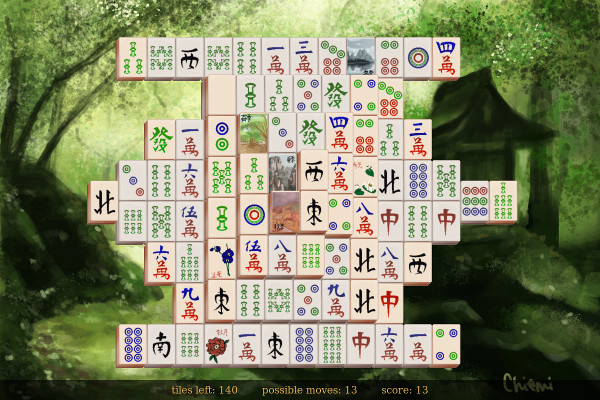

# js-mahjong
Rudimentary javascript based mahjong game built on top of a html canvas element.

Should work on most modern browsers that support HTML5 canvas element.  
The game could use some polishing, but it is fully functional.

Graphical resources shamelessly ripped from the internet, no personal gain is intended.
